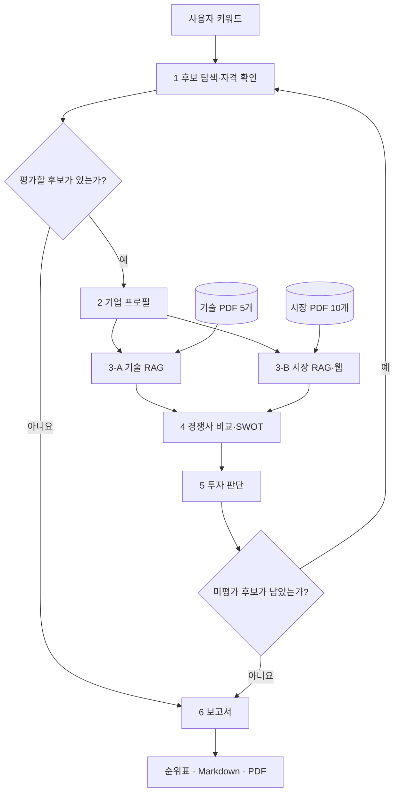

# AI 신약개발 스타트업 투자 평가 에이전트

> **통합 상태:** 이 발표용 README의 전체 Graph·CLI 실행과 15개 PDF 검색 평가 수치는 [`codex/presentation-rubric` 브랜치](https://github.com/ai-invest-eval/invest-agent/tree/codex/presentation-rubric) 기준입니다. 현재 `main`에는 개별 에이전트와 확장된 PDF 20개가 있으며 전체 Graph 연결은 아직 반영되지 않았습니다. 전체 실행 명령은 발표 브랜치에서 사용하세요.

## 1. 문제 정의와 차별점

초기 바이오 기업은 매출만으로 평가하기 어렵습니다. 신약 후보의 실험·임상 단계, AI 기술의 실제 검증, 제약사 계약의 선급금, 시장의 정의, 특허 권리 범위가 투자 판단을 바꿉니다. 이 프로젝트는 Healthcare AI 중 **AI 신약개발**로 범위를 좁혀 의료 영상 진단 기업과 동일한 잣대로 비교하지 않습니다.

| 항목 | 팀이 정한 범위 |
| --- | --- |
| 평가 대상 | 국내외 비상장 AI 신약개발 스타트업, Seed~Series C, Exit 전, 대기업 비자회사 |
| 입력 | 탐색 키워드, 기업별 공개 웹 자료, 기술·시장 PDF 15개 |
| 결과 | 적격 후보 전원의 점수·판정 순위표와 통과 1위의 투자 심사 보고서. 통과 기업이 없으면 “투자 추천 없음” |
| 핵심 차별점 | 최신 **기업 사실은 웹**에서 확인하고, 기술·시장 **판단 기준은 RAG**로 보강; 확인·추론·결측을 구분; 점수 합산·관문·순위는 코드가 결정 |

후보 자격은 탐색과 최종 판정에서 확인합니다. **75점 통과선은 팀이 설정한 투자 심사 정책**이며 실제 수익률이나 성공 확률을 뜻하지 않습니다. 세부 기준은 [투자평가기준 v4](docs/investment_criteria_v4.md)와 [공통 데이터 계약](docs/data_contracts.md)에 있습니다.

## 2. 에이전트와 Graph 흐름



한 후보에 대해 2번이 프로필을 확정하면 3-A·3-B가 **병렬**로 분석하고, 두 결과가 모두 온 뒤 4번이 비교합니다. 5번은 통과·보류를 모두 `evaluation_history`에 누적합니다. [`src/graph.py`](src/graph.py)는 남은 후보가 있으면 1번으로 돌아가고, 없으면 6번을 **한 번** 실행합니다. 후보가 0곳이어도 6번이 무추천 보고서를 작성합니다.

| 번호 | 역할과 책임 | 코드 |
| --- | --- | --- |
| 1 | [StartupSearch](src/agents/agent1_search.py): 키워드 탐색, 자격 검증, 다음 미평가 후보 선택 | Tavily·구조화 LLM |
| 2 | [CompanySummary](src/agents/agent2_profile.py): 기업 프로필·사업 모델·대표 시장 표준화 | 웹검색·LLM 추출·규칙 검증 |
| 3-A | [TechAnalysis](src/agents/agent3a_tech.py): 기술 검증·개발 단계·규제 위험 | 기술 RAG |
| 3-B | [MarketAnalysis](src/agents/agent3b_market.py): 대표 시장 규모·수요·성장성 | 시장 RAG·필요 시 웹 |
| 4 | [CompetitorAnalysis](src/agents/agent4_competitor.py): 동종사·빅테크·자체 연구/CRO 대체재 비교, SWOT | 웹검색·근거 검증 |
| 5 | [InvestmentDecision](src/agents/agent5_decision.py): 질문별 채점, 결측·관문·판정, 이력 누적 | LLM Judge + 결정론적 코드 |
| 6 | [ReportWriter](src/agents/agent6_report.py): 전체 순위·추천/무추천 보고서 | 코드 정렬·LLM 문장·PDF 변환 |

## 3. Agentic RAG: 무엇을 검색하고 어떻게 검증하나

| 코퍼스 | 자료 | 검색 목적 |
| --- | ---: | --- |
| [`data/technology/`](data/technology/) | PDF 5개, 115쪽 | AI 기술, 실험·임상 검증, 개발·규제 기준 |
| [`data/market/`](data/market/) | PDF 10개, 82쪽 | 시장 정의·규모, 투자·파트너십 환경 |
| 합계 | **PDF 15개, 197쪽** | 설계 산출물의 200쪽 이내 문서 풀 |

[`src/rag/build_index.py`](src/rag/build_index.py)는 BGE-M3 토큰 기준 1,000토큰·200토큰 겹침으로 PDF를 분할하고 원문 쪽수·서지정보를 보존합니다. 이 환경에서 기술 122개·시장 85개 청크의 색인을 생성하고 재사용을 확인했습니다. 한국어·영어 자료를 위해 오픈소스 **BAAI/bge-m3** Dense 임베딩과 **Kiwi BM25**를 사용합니다. [`src/rag/retrieval.py`](src/rag/retrieval.py)는 두 검색의 각 top-5를 RRF로 합쳐 최종 5개 청크를 반환합니다. 문서·메타데이터·설정 해시로 색인을 재사용합니다.

**질문 계획 → 기술/시장·주제 필터 → 하이브리드 검색 → LLM 근거 적합성 판단 → 부족하면 검색어를 바꿔 1회 재검색 → 필요한 경우 웹 보완 → 실제 사용 출처 연결**이 Agentic RAG 흐름입니다. 청크가 검색됐다는 사실만으로 특정 회사의 기술력이나 시장 규모가 증명되지는 않습니다. 인용문과 출처의 일치 여부를 검사하고도 부족하면 “정보 부족”을 남깁니다. 시장 수치는 “AI 신약”, “AI 생명공학”, “전체 전문의약품”처럼 **시장 정의·연도·단위**를 함께 적습니다. API 키가 없는 추출 모드에서도 기술·시장 분석 필드와 출처 10개가 State에 저장되는 것을 확인했습니다. 이 모드는 LLM 분석 품질을 검증하지 않습니다.

[검색 평가 가이드](docs/taewoo_quickstart.md)에 기록된 **24문항 개발셋** 결과를 이 환경의 새 색인으로 다시 측정했습니다. 수치는 다음과 같습니다.

| 검색 방식 | Hit@1 | Hit@3 | Hit@5 | MRR@5 |
| --- | ---: | ---: | ---: | ---: |
| BGE-M3 Dense | 0.417 | 0.750 | 0.833 | 0.588 |
| Kiwi BM25 | 0.333 | 0.542 | 0.708 | 0.470 |
| Dense + BM25 RRF | 0.542 | 0.667 | 0.792 | 0.619 |

하이브리드는 이 개발셋에서 Hit@1·MRR을 높였지만 **Hit@3·5는 Dense보다 낮습니다.** 이는 작은 개발셋 결과이지 투자 평가의 타당성 검증이 아닙니다.

## 4. 공통 State와 투자 판단

모든 노드는 [`InvestmentState`](src/state.py)를 입력받아 자기 역할의 변경분만 반환합니다. `startup_profile`과 현재 분석은 다음 후보에서 초기화하고, `evaluation_history`와 `references`는 reducer로 누적합니다. 미확인은 JSON `null`, 확인 결과 없는 목록은 `[]`로 구분합니다. 금액·날짜·투자 단계와 출처 형식은 [공통 데이터 계약](docs/data_contracts.md)을 따릅니다.

| 평가 영역 | 비중 | 질문 |
| --- | ---: | --- |
| 창업자 | 30% | QA 팀 신뢰도 · QB 장기 헌신 · QC 실행력 |
| 시장성 | 25% | QD 시장 크기 · QE 미충족 수요 · QF 확장 기회 |
| 제품·기술력 | 15% | QG AI 독창성 · QH 구현·검증 단계 |
| 경쟁우위 | 10% | QI 차별성 · QJ 진입장벽 |
| 실적 | 10% | QK 비용 지불 이유 · QL 초기 반응 · QM 수익 모델 |
| 투자조건 | 10% | QN 동단계 밸류에이션 · QO 투자 구조 |

질문별 1~5점과 근거는 LLM이 구조화해 제안하고, **코드가** 결측 점수·가중 합산·관문·최종 판정·정렬을 처리합니다. `영역 점수 = 질문 평균 ÷ 5 × 100`, `총점 = Σ(영역 점수 × 비중)`입니다.

1. 자격 관문(상장·Series D 이상, 대기업 자회사)이 해당하거나 **미확인**이면 보류합니다. 임상 실패·창업자 이탈/분쟁·핵심 특허 패소·투자 공백과 구조조정 등 위험 관문이 확인되면 보류합니다. 위험 관문 미확인은 평가를 계속하되 표시합니다.
2. 결측 비중 **30% 이상**이면 “근거 부족”으로 보류합니다. 근거 없는 질문은 2점, QN·QO는 3점으로 기록하고 모두 결측 비중에 넣습니다.
3. 총점 **75점 이상**이고 창업자 영역 **60점 이상**이면 통과합니다. 통과 1위만 “투자 추천”이고 나머지는 “투자 검토 가능”입니다. 총점 → 창업자 → 시장성으로 순위를 정합니다.

공식 자료에서 **없다고 확인된 사실**과 자료를 **찾지 못한 상태**는 다르게 처리합니다. 2번이 `pipeline` 또는 `platform`으로 확정한 사업 모델에 따라 QD 시장 크기의 기준표도 다릅니다. 상세한 15문항 채점표는 [투자평가기준 v4](docs/investment_criteria_v4.md)에 있습니다.

## 5. 코드 구조와 실행 방법

```text
.
├── app.py                       # 개별 노드 / 전체 Graph CLI
├── src/
│   ├── agents/                  # 1, 2, 3-A, 3-B, 4, 5, 6
│   ├── rag/                     # PDF 적재·청킹·FAISS·BM25·검색 평가
│   ├── tools/                   # 웹검색·LLM·보고서 변환
│   ├── graph.py                 # 병렬 합류, 후보 반복, 종료 분기
│   ├── state.py                 # 공통 State·누적 reducer
│   └── schemas.py               # 노드별 Update 형식
├── data/{technology,market}/    # 원본 PDF 15개
├── docs/                       # 투자 기준·데이터 계약·실행 가이드
├── samples/                    # 가상 입력·검색 평가 질문
├── tests/                      # 노드·RAG·Graph 테스트
└── pyproject.toml / uv.lock / .env.example
```

[uv](https://docs.astral.sh/uv/getting-started/installation/)와 Python **3.11.11**이 필요합니다. `--extra rag`는 PDF·FAISS·임베딩 의존성을 함께 설치합니다.

```bash
uv python install 3.11.11
uv sync --extra rag
cp .env.example .env

# PDF 색인 1회 생성·재사용 (첫 실행은 임베딩 모델 다운로드)
uv run --extra rag python -m src.rag.build_index

# 키 설정 후, 실제 후보 탐색부터 전체 평가·보고서 생성
uv run --extra rag python app.py --keyword "AI 신약개발 스타트업" --max-candidates 3

# 키 없이 가상 평가 이력으로 전체 Graph의 보고서 경로 시연
REPORT_USE_LLM=0 uv run --extra rag python app.py --state samples/report_state.json
REPORT_USE_LLM=0 uv run --extra rag python app.py --state samples/report_state_no_pass.json

# 자동 테스트·검색 평가
uv run --extra rag python -m pytest -q
uv run --extra rag python -m src.rag.evaluate
```

`app.py --agent 1|2|3a|3b|4|5|6 --state <JSON>`으로 개별 노드를 실행할 수도 있습니다. 3-A/3-B 샘플·색인 명령은 [RAG 실행 가이드](docs/taewoo_quickstart.md)에 있습니다. 전체 Graph는 API 호출과 색인 준비가 필요하며, **실제 기업의 라이브 끝단 간 실행은 아직 검증되지 않았습니다.** 가상 이력 명령은 실제 검색·RAG·채점을 대신하지 않고 보고서 생성 경로만 검증합니다.

6번은 Markdown → HTML → WeasyPrint로 PDF를 만듭니다. 시스템 Pango가 필요합니다(macOS: `brew install pango`; 다른 OS는 [설치 안내](https://doc.courtbouillon.org/weasyprint/stable/first_steps.html)). 기본 결과는 `outputs/investment_report.md`와 `.pdf`이며, LLM Judge를 실행한 경우에만 `_judge.json`이 추가됩니다. `REPORT_OUTPUT_DIR`·`REPORT_FILE_STEM`으로 저장 위치와 이름을 바꿀 수 있습니다. 생성 파일과 색인은 Git에서 제외됩니다.

## 6. 투자 보고서의 핵심 포인트

**제출된 2쪽짜리 투자 심사 보고서의 결론은 “투자 추천 없음”입니다.** AI 신약개발 후보 4곳의 점수는 아토매트릭스 58.7점, 아이젠사이언스 49.3점, 히츠 48.5점, 신세틱게슈탈트 45.3점 순이며, 통과 0곳·보류 4곳입니다. 최고점도 75점 기준에 못 미쳤고, **3곳은 결측 비중이 60~72%로 30% 보류 기준을 초과**했습니다. 나머지 1곳은 보고서에서 “핵심 특허 분쟁 패소” 관문으로 보류됐다고 기록합니다. 이는 해당 법적 사실을 README가 별도로 검증했다는 뜻은 아닙니다.

이 결과의 핵심은 낮은 점수만이 아니라 **판단 근거의 공백**입니다. 최고점인 아토매트릭스도 장기 헌신·확장 기회·AI 독창성·검증 단계·차별성·진입장벽·초기 반응·수익 모델·밸류에이션·투자 구조 등 10개 질문의 근거가 부족했습니다. 보고서는 주력 파이프라인의 임상 중단·실패 여부와 핵심 특허 분쟁 여부도 미확인 관문으로 남기고, 이 근거를 확보한 뒤 같은 기준으로 재평가할 것을 제안합니다. 첫 페이지는 결론·순위·보류 사유를, 둘째 페이지는 재검토 조건과 사용 출처를 보여줍니다. **이 문단은 제출 PDF의 결과 요약이며, 원자료와 개별 기업 사실의 독립 검증 결과는 아닙니다.**

## 7. Lessons Learned

### 검색된 문장과 기업의 경쟁력 증거는 다릅니다 (박민규)

동종사·빅테크·기존 연구 방식을 비교할 때 이름을 많이 찾는 것보다 **같은 조건에서 확인된 근거**를 구분하는 일이 중요했습니다. 출처가 있는 사실, 상위 분석에서 가져온 추론, 확인되지 않은 정보를 나눠 5번에 전달해야 과장된 차별성 점수와 섣부른 투자 결론을 막을 수 있었습니다.

### RAG에서는 검색 결과를 분석 근거로 사용할 수 있는지 검증하는 과정이 중요했습니다 (구태우)

수업에서 배운 PDF 분할, 벡터 검색, Kiwi 기반 키워드 검색, LangGraph의 재검색 흐름을 기술·시장 분석 에이전트에 적용했습니다. BGE-M3와 BM25를 결합해 관련 자료를 찾았지만, 검색된 문장이 있다는 것만으로 해당 기업의 기술력이나 시장성을 설명할 수 있는 것은 아니었습니다. 실제 실행에서도 LLM이 인용문과 출처를 잘못 연결하는 경우가 있어 원문과 출처를 검증하고, 근거가 부족하면 한 번 재검색한 뒤에도 확인되지 않는 내용은 “정보 부족”으로 표시했습니다. 이를 통해 RAG는 자료를 잘 찾는 것뿐 아니라 산업 전체의 정보와 개별 기업의 증거를 구분하고, 근거의 한계를 결과에 드러내는 설계가 중요하다는 점을 배웠습니다.

### LLM에 맡길 부분과 코드로 처리할 부분을 나눠야 했습니다 (배재연)
**목차를 먼저 정하면 개발이 빠릅니다.** 설계서 8장에 목차와 항목별 입력 데이터를 미리 정해 둬서 그대로 코드로 옮길 수 있었습니다. **숫자와 형식은 코드, 문장만 LLM에 맡깁니다.** LLM이 본문 번호와 점수를 틀리게 적는 것을 보고 틀리면 안 되는 부분을 코드로 옮겼습니다. **LLM-as-a-Judge도 기준이 구체적이어야 합니다.** 같은 모델이 채점하니 처음엔 후했습니다. 감점 기준을 명확히 적어 주자 실제 오류를 잡았습니다. 이는 강의에서 다룬 “자기 모델 평가” 문제와도 연결됩니다.

### 투자 판단 에이전트는 받은 근거를 검증하고 다음 단계로 넘기는 연결 지점이었습니다 (구본준)
LLM은 질문별 채점만 하고, 결측 처리·합산·관문·판정은 코드가 맡아 같은 입력에는 항상 같은 판정이 나오도록 했습니다. 2번의 사업 모델 분류는 다시 하지 않고, 관문의 `None`은 미확인으로 남겼습니다. 질문별 근거·출처는 `question_evidence`에 담아 6번 보고서가 인용만 하도록 연결했습니다. 판정 품질은 결국 앞 단계가 넘겨주는 근거에 달려 있어서, 근거가 부족하면 억지로 추천하지 않고 보류하는 구조가 더 안전하다고 느꼈습니다.

### 에이전트는 기능에 집중하고 구조는 단순하게 유지해야 했습니다 (원종현)

후보 탐색 에이전트에 검증과 재검색을 과하게 추가하면서 코드와 실행 시간이 불필요하게 늘어났습니다. 후보 수집·자격 판단·다음 후보 선택이라는 핵심 기능에 집중하고, 공통 State의 입출력 계약을 유지하면서 구조를 단순화하는 것이 협업과 유지보수에 더 중요하다는 점을 배웠습니다.

### LLM에게는 추출을, 판정은 검증 가능한 규칙에 맡겨야 했습니다 (김한솔)

LLM의 출력은 결론이 아닌 검증 대상이며, 결과를 좌우하는 판단일수록 검증 가능한 규칙에 두어야 한다는 것을 배웠습니다. 기업 프로필을 수집하는 2번 에이전트를 맡으며 LLM이 제휴 제약사를 모회사로 오인해 유망 기업이 “대기업 자회사” 관문으로 탈락할 뻔한 오류가 반복됐습니다. 프롬프트 보강만으로는 실행마다 달라지는 출력을 통제할 수 없었고, LLM의 역할을 “근거가 달린 사실 추출”로 한정한 뒤 판정은 결정론적 코드 규칙으로 검증하도록 구조를 바꾸면서 해결했습니다. 앞으로도 LLM의 추출과 규칙의 판정을 먼저 구분하는 것을 설계 원칙으로 가져가겠습니다.
