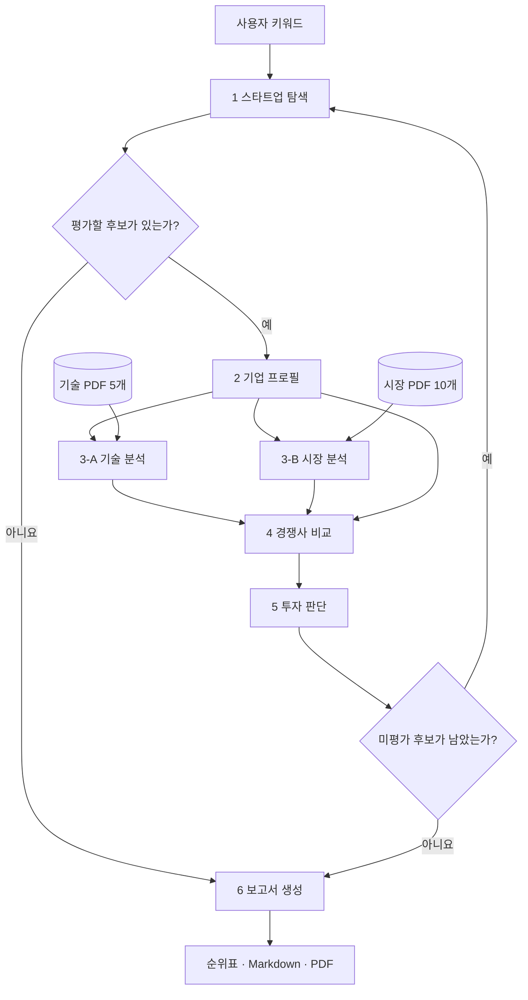

# AI 신약개발 스타트업 투자 평가 에이전트

> **Healthcare AI · LangGraph Multi-Agent · Agentic RAG**
> 국내외 AI 신약개발 스타트업을 발굴하고, 검증 가능한 근거로 후보 전원을 평가해 투자 심사 보고서를 만드는 프로젝트입니다.

**현재 개발 상태 (2026-09-30):** 기업 프로필(2), 경쟁사 비교(4), 투자 판단(5), 보고서(6)는 개별 실행 코드가 있습니다. 스타트업 탐색(1), 기술·시장 분석(3-A/3-B), RAG 색인, LangGraph 연결은 아직 구현 골격입니다. 따라서 아래 **전체 워크플로우는 설계 목표**이며, 지금 바로 실행할 수 있는 범위는 [실행과 검증](#실행과-검증)을 참고하세요.

## 문제와 목표

일반 재무 지표만으로 초기 AI 신약개발 기업을 비교하기는 어렵습니다. 파이프라인의 실제 검증 단계, 시장 정의, 제약사 계약의 성격, 기술 차별성, 공개되지 않은 투자조건을 함께 봐야 합니다. 우리는 **Healthcare AI 중 AI 신약개발**로 범위를 좁히고, 자료의 출처와 결측을 남기는 평가 흐름을 설계했습니다.

| 항목 | 프로젝트 기준 |
| --- | --- |
| 입력 | 탐색 키워드와 공개 웹 자료, 기술·시장 PDF 코퍼스 |
| 평가 대상 | 국내외 비상장 AI 신약개발 스타트업 중 Seed~Series C, Exit 전, 대기업 비자회사 |
| 처리 | 후보 발굴 → 프로필 → 기술·시장 분석 → 경쟁사 비교 → 15문항 채점 → 전체 후보 순위 |
| 산출물 | 후보 전원 순위표와 통과 기업 1위의 투자 심사 보고서(Markdown·5쪽 이내 PDF). 통과 기업이 없으면 “투자 추천 없음” |
| 원칙 | 확인된 사실과 추론·미확인을 구분하고, 평가에 사용한 출처만 보고서에 기재 |

이 자격·점수·보고서 기준은 팀 [투자평가기준 v4](docs/investment_criteria_v4.md)와 [공통 데이터 계약](docs/data_contracts.md)에 따릅니다. **75점 통과선은 팀이 정한 판단 정책**이며 실제 투자 성과를 예측하는 검증된 확률이 아닙니다.

## 전체 흐름 (설계)



후보는 **한 기업씩** 평가합니다. 3-A와 3-B는 같은 프로필을 바탕으로 병렬 분석하고, 4번은 두 분석이 모두 끝난 뒤 실행합니다. 5번은 통과·보류 모두 평가 이력에 남기며, 마지막 후보까지 평가한 뒤 6번이 한 번 보고서를 만듭니다. 이 흐름을 연결할 `src/graph.py`는 현재 TODO입니다.

| 번호 | 에이전트 | 주된 입력 → 출력 | 현재 상태 |
| --- | --- | --- | --- |
| 1 | [StartupSearch](src/agents/agent1_search.py) | 키워드·평가 이력 → 적격 후보 목록·현재 후보 | 골격 |
| 2 | [CompanySummary](src/agents/agent2_profile.py) | 현재 후보 → 표준 기업 프로필·출처 | 구현 |
| 3-A | [TechAnalysis](src/agents/agent3a_tech.py) | 프로필·기술 RAG → 기술 분석·출처 | 골격 |
| 3-B | [MarketAnalysis](src/agents/agent3b_market.py) | 프로필·시장 RAG·웹 → 시장 분석·출처 | 골격 |
| 4 | [CompetitorAnalysis](src/agents/agent4_competitor.py) | 프로필·기술·시장 분석 → 경쟁 비교·SWOT·출처 | 구현 |
| 5 | [InvestmentDecision](src/agents/agent5_decision.py) | 분석 결과·출처 → 질문별 근거·점수·판정 이력 | 구현 |
| 6 | [ReportWriter](src/agents/agent6_report.py) | 평가 이력·출처 → Markdown·PDF 보고서 | 구현 |

### 4번 경쟁사 비교에서 5번 채점으로

4번은 동종 AI 신약개발 기업, 관련 빅테크 제품, 제약사 자체 연구·CRO 같은 대체재를 **같은 업무·적응증·검증 조건**에서 비교합니다. 기업의 강점·약점·기회·위협(SWOT)과 함께 QI 차별성, QJ 진입장벽, QK 비용 지불 이유, QL 초기 반응, QM 수익 모델에 쓸 **근거**를 전달합니다. 4번은 점수나 투자 결론을 만들지 않고 5번이 기준표에 따라 채점합니다.

비교문마다 웹 출처의 실제 본문 인용을 연결하고 `supported`(확인), `inference`(추론), `unknown`(미확인)을 구분합니다. 특허 **출원**을 등록으로, MOU를 유료 계약으로, 계약의 잠재 총액을 선급금으로 바꾸어 적지 않습니다. 근거를 찾지 못한 항목은 경쟁력이 없다고 단정하지 않습니다.

## Agentic RAG 설계와 자료

기업의 최신 투자 라운드·계약·경쟁사 현황은 **웹검색**으로 확인하고, 기술·규제·시장에 관한 비교 기준은 **PDF RAG**로 보강합니다. PDF에 등장한 상장기업을 투자 후보로 자동 편입하지 않습니다. 시장 수치를 쓸 때는 “AI 신약 시장”, “AI 기반 생명공학 시장”, “전체 전문의약품 시장”처럼 **시장 정의와 기준연도**를 함께 남깁니다.

| 코퍼스 | 자료 | 용도 |
| --- | ---: | --- |
| [`data/technology/`](data/technology/) | PDF 5개, 115쪽 | AI 기술·실험 검증, 개발 단계, 규제 위험 |
| [`data/market/`](data/market/) | PDF 10개, 82쪽 | 시장 규모·성장률, 투자·파트너십 환경 |
| 합계 | **PDF 15개, 197쪽** | 설계 산출물의 200쪽 이내 문서 풀. 검색 색인은 아직 미구현 |

**예정 검색 과정:** 질문 계획 → `tech/market`·주제별 필터 → BGE-M3 Dense(FAISS)와 Kiwi BM25 각 top-5 → RRF로 최종 5개 청크 → LLM이 수치·기준·사례의 적합성을 판단 → 부족하면 검색어를 바꿔 최대 1회 재검색 → 문서 밖 세부 정보는 웹으로 보완 → 실제 사용한 쪽수·서지정보를 출처에 기록합니다. 기본 청킹은 1,000토큰, 겹침은 200토큰으로 설계했습니다.

오픈소스 임베딩 **BAAI/bge-m3**는 한국어·영어 혼합 문서와 긴 청크에 대응하기 위한 1차 선택입니다. 선정 근거는 설계 단계의 가설입니다. 20~30개 질문·정답 청크로 dense 후보 4개를 비교하고 Hit Rate@1/3/5와 MRR을 측정할 계획이며, 다른 후보가 Hit Rate@5에서 5%p 이상 앞서면 교체합니다. **실측 검색 성능은 아직 없습니다.** [`src/rag/build_index.py`](src/rag/build_index.py)에도 색인·검색 구현이 남아 있습니다.

## 공통 State와 출처 계약

모든 노드는 [`InvestmentState`](src/state.py)를 읽고 자기 역할의 변경분만 반환합니다. 프로필·분석·현재 판정은 다음 후보로 넘어갈 때 초기화하고, `evaluation_history`와 `references`는 누적합니다. 3-A·3-B는 각각 자기 분석 필드와 새 출처만 반환하므로 병렬 실행 시 덮어쓰지 않습니다.

| State 필드 | 의미 |
| --- | --- |
| `candidate_startups`, `selected_startup` | 적격 후보 목록과 현재 분석 기업 |
| `startup_profile` | 기업 정보·사업 모델(`pipeline`/`platform`/`unknown`)·자격/위험 관문 |
| `tech_analysis`, `market_analysis`, `competitor_analysis` | 기술·시장·경쟁 비교 결과 |
| `investment_decision`, `evaluation_history` | 현재 기업 판정과 후보별 누적 점수·근거 |
| `references`, `final_report` | 사용한 출처와 최종 Markdown 보고서 |

수집하지 못한 값은 JSON `null`로, **확인 결과 없는 목록**은 `[]`로 구분합니다. 금액은 원문 통화와 환산 근거를 분리하고, 날짜는 확인한 연·월·일까지만 기록합니다. 출처는 기업명, 에이전트, 문서 제목, URL 또는 PDF 쪽수, 발행 정보로 추적합니다. 상세 형식과 reducer 규칙은 [공통 데이터 계약](docs/data_contracts.md)과 [CONTRIBUTING.md](CONTRIBUTING.md)에 있습니다.

## 투자 판단 기준

과제에 제시된 Scorecard Method의 영역과 Bessemer 체크리스트 질문을 **AI 신약개발에 맞게 변형한 팀 기준**입니다. 질문별 1~5점과 근거는 5번의 LLM이 만들고, 결측 대체·가중 합산·관문·정렬·최종 판정은 코드가 수행합니다.

| 영역 | 비중 | 질문 |
| --- | ---: | --- |
| 창업자 | 30% | QA 팀 신뢰도 · QB 장기 헌신 · QC 실행력 |
| 시장성 | 25% | QD 시장 크기 · QE 미충족 수요 · QF 확장 기회 |
| 제품·기술력 | 15% | QG AI 독창성 · QH 구현·검증 단계 |
| 경쟁우위 | 10% | QI 차별성 · QJ 진입장벽 |
| 실적 | 10% | QK 비용 지불 이유 · QL 초기 반응 · QM 수익 모델 |
| 투자조건 | 10% | QN 동단계 밸류에이션 · QO 투자 구조 |

`영역 점수 = 영역 질문 평균 ÷ 5 × 100`, `총점 = Σ(영역 점수 × 비중)`입니다. 아래 순서로 판정합니다.

1. 상장·Series D 이상 또는 대기업 자회사, 주력 임상 실패, 창업자 이탈·분쟁, 핵심 특허 패소, 투자 공백과 구조조정 등 **관문**에 해당하면 보류합니다. 자격 관문 미확인도 보류하며, 위험 관문 미확인은 평가를 진행하되 보고서에 표시합니다.
2. 결측 비중이 **30% 이상**이면 근거 부족으로 보류합니다. 확인되지 않은 질문은 2점, 투자조건 QN·QO는 3점을 적용하고 모두 결측 비중에 포함합니다.
3. 총점 **75점 이상**이고 창업자 영역 **60점 이상**이면 통과합니다. 그 외는 보류합니다.
4. 전체 후보를 총점 → 창업자 → 시장성 순으로 정렬합니다. 통과 기업 1위를 “투자 추천”, 다른 통과 기업을 “투자 검토 가능”으로 표기합니다.

**확인된 없음과 정보 없음은 다릅니다.** 예를 들어 공식 자료가 계약 부재를 명시한 경우에는 기준표에 따라 점수를 주지만, 자료를 못 찾은 경우에는 결측으로 처리합니다. QD 시장 크기도 프로필이 확정한 `pipeline`/`platform` 유형에 맞는 **서로 다른 시장 기준**을 사용합니다. 질문별 세부 1~5점 기준과 관문 이름은 [투자평가기준 v4](docs/investment_criteria_v4.md)를 확인하세요.

## 보고서와 검증

6번은 모든 후보의 평가 이력으로 순위표를 만들고, 통과 1위의 **SUMMARY → 상세 분석(기술·시장·경쟁·팀·실적·리스크) → REFERENCE**를 작성합니다. 통과 기업이 없으면 근거를 설명하는 “투자 추천 없음” 보고서를 만듭니다. PDF는 5쪽 상한을 검사하며, 실제 본문에 사용한 자료만 중복 없이 참고문헌에 넣습니다.

LLM을 사용할 때는 각 절의 **충실성·관련성**을 1~5점으로 검토하고, 4점 미만인 절을 한 번 다시 쓴 뒤에도 미달이면 평가 근거 문장으로 대체합니다. 이는 보고서 문장의 내부 점검이며, 실제 투자 결과를 검증했다는 뜻은 아닙니다. API 키가 없거나 `REPORT_USE_LLM=0`이면 평가 이력의 근거 문장으로 보고서를 채웁니다.

## 실행과 검증

[uv](https://docs.astral.sh/uv/getting-started/installation/)와 Python **3.11.11**이 필요합니다. 저장소 루트에서:

```bash
uv python install 3.11.11
uv sync
cp .env.example .env
```

`.env`의 `OPENAI_API_KEY`, `TAVILY_API_KEY`는 필요한 개별 노드 실행에만 입력합니다. `.env`는 Git에 올리지 않습니다. `OPENAI_MODEL` 기본값은 `gpt-4o-mini`, 후보 상한은 `MAX_CANDIDATES=15`이며 CLI의 `--max-candidates`가 우선합니다. API 사용에는 네트워크 연결과 서비스 이용 권한이 필요합니다.

```bash
# 제공된 샘플 State로 개별 에이전트 실행
uv run python app.py --agent 2 --state samples/state_agent2_input.json
uv run python app.py --agent 5 --state samples/state_agent5_pipeline.json

# 보고서 단독 데모: 제공된 가상 평가 이력 사용, LLM 호출 없이 실행
REPORT_USE_LLM=0 uv run python app.py --agent 6 --state samples/report_state.json
REPORT_USE_LLM=0 uv run python app.py --agent 6 --state samples/report_state_no_pass.json

# 자동화 테스트 (테스트용 pytest를 일시적으로 추가)
uv run --with pytest python -m pytest -q
```

2번은 Tavily·OpenAI 키가 있어야 실제 검색/추출을 수행합니다. 4번도 이전 노드의 `startup_profile`, `tech_analysis`, `market_analysis`가 채워진 State와 API 키가 필요하므로 현재 저장소에는 바로 실행할 수 있는 독립 샘플을 제공하지 않습니다. 5번은 제공된 샘플과 OpenAI 키로 질문별 채점을 수행합니다. 샘플 데이터와 보고서 데모는 **가상 데이터**이며 실제 투자 추천이 아닙니다. 6번 PDF 변환에는 시스템 Pango 라이브러리가 필요합니다. macOS는 `brew install pango`, 다른 OS는 [WeasyPrint 설치 안내](https://doc.courtbouillon.org/weasyprint/stable/first_steps.html)를 참고하세요.

Markdown은 `outputs/investment_report.md`에 저장됩니다. PDF는 Pango가 설치되어 변환에 성공했을 때 `outputs/investment_report.pdf`로 저장되고, LLM Judge 실행 기록이 있을 때만 `outputs/investment_report_judge.json`이 생성됩니다. 이 파일들은 Git에서 제외됩니다. `REPORT_OUTPUT_DIR`와 `REPORT_FILE_STEM`으로 경로·이름을 바꿀 수 있습니다. **`uv run python app.py`만으로 전체 파이프라인은 아직 실행되지 않습니다.** 색인 명령도 구현 전이므로 재현 가능한 전체 실행 명령은 통합 후 추가할 예정입니다.

## 프로젝트 구조

```text
.
├── app.py                   # 개별 에이전트 CLI / 전체 실행 골격
├── src/
│   ├── agents/              # 1~6번 에이전트
│   ├── rag/build_index.py   # PDF 색인 골격
│   ├── tools/              # 보고서 변환·표시
│   ├── config.py            # 공통 설정
│   ├── graph.py             # LangGraph 연결 골격
│   ├── schemas.py           # 공통 입출력 형식
│   └── state.py             # 공유 State
├── data/{technology,market}/ # PDF 15개
├── docs/                   # 데이터 계약·투자 기준
├── samples/                # 개별 노드용 가상 State
├── tests/                  # 2·5·6번 테스트
├── .env.example
├── pyproject.toml
├── uv.lock
└── CONTRIBUTING.md
```

## 과제·발표 점검표

| 반드시 설명하거나 확인할 요소 | 이 저장소의 근거와 현재 상태 |
| --- | --- |
| 도메인·문제·평가 대상 | AI 신약개발로 범위 제한, 비상장 Seed~Series C 등 자격과 제외 기준 정의 |
| 역할이 분리된 에이전트와 그래프 | 1→2→(3-A·3-B)→4→5→반복→6 설계. **전체 연결 미구현** |
| 도메인 문서 기반 RAG와 웹 역할 구분 | 기술 5개·시장 10개 PDF와 사용 목적 정의. **색인·검색 미구현** |
| 임베딩 선정의 이유와 검색 평가 | BGE-M3 1차 선정, 4모델·Hit Rate/MRR 비교 계획. **실측 결과 없음** |
| 공통 State·출처·결측 처리 | [`src/state.py`](src/state.py), [`src/schemas.py`](src/schemas.py), [데이터 계약](docs/data_contracts.md) |
| 일관된 투자 판단과 실패/무추천 분기 | 6영역·15질문, 관문·결측·75점/60점 규칙. 5·6번 개별 구현, 전체 분기 미연결 |
| 5쪽 이내 보고서와 참고문헌 | 6번의 Markdown/PDF 생성·페이지 검사 구현. 가상 이력으로 단독 시연 가능 |
| 실행 재현성과 비밀정보 관리 | `uv.lock`, `.env.example`, 개별 실행·테스트 명령 제공. 전체 실행·인덱스 명령은 통합 후 필요 |

이 표는 팀 설계 산출물과 현재 코드의 대조입니다. **미구현 항목을 완료로 간주하지 않습니다.** 다음 작업은 1·3-A·3-B와 색인 구현, 검색 품질 실측, 그래프 연결, 실제 후보를 통한 끝단 간 검증입니다.

## 팀

| 담당 | 역할 |
| --- | --- |
| 원종현 | 스타트업 탐색·자격 검증 |
| 김한솔 | 기업 프로필 |
| 구태우 | RAG, 기술·시장 분석 |
| 박민규 | 경쟁사 비교 |
| 구본준 | 평가 기준·투자 판단 |
| 배재연 | 보고서·PDF 출력 |

작업 브랜치, 커밋, 리뷰·병합 규칙은 [CONTRIBUTING.md](CONTRIBUTING.md)를 따릅니다. 문서 구성은 [Agentic RAG Manufacturing Investment Evaluator의 README](https://github.com/the-front-row-on-the-left/agentic-rag-manufacturing-investment/blob/main/README.md)를 참고했으며, 도메인·평가 규칙·구현 상태는 이 프로젝트의 설계와 코드를 기준으로 작성했습니다.
